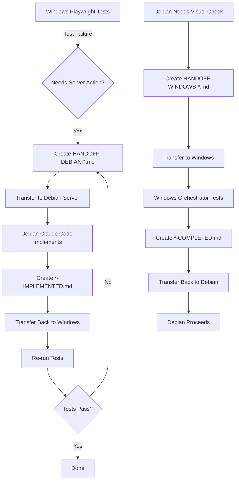

# Playwright Testing Handoff - Windows Orchestrator

**Purpose:** Remote visual and console testing from Windows machine
**Target Environment:** Debian 13 server (budget.okamih.cz)
**AI Orchestrator:** Windows-based (Cursor/Claude Code/Windsurf)
**Date Created:** 2025-11-15

---

## Overview

This template enables a Windows-based AI orchestrator to run Playwright tests against the Budget Control application deployed on a Debian 13 server, with proper handoff mechanisms for tasks that require visual feedback or browser console access.

---

## Prerequisites on Windows Machine

### Required Software

1. **Node.js** (v18 or higher)
   ```bash
   node --version  # Should be v18+
   npm --version
   ```

2. **Git**
   ```bash
   git --version
   ```

3. **Playwright**
   ```bash
   npm install -g playwright
   playwright install  # Installs browsers
   ```

4. **SSH Client** (for communication with Debian server)
   - Windows PowerShell (built-in)
   - Or PuTTY/Git Bash

---

## Setup Instructions

### Step 1: Clone Repository to Windows

```powershell
# Create workspace directory
cd C:\Users\YourUsername\
mkdir budget-control-testing
cd budget-control-testing

# Clone from GitHub (or download directly from server)
git clone https://github.com/pkoka888/budget-control.git
cd budget-control

# Or sync from server via SCP:
scp -r claude@budget.okamih.cz:/var/www/budget-control/ ./
```

### Step 2: Install Dependencies

```powershell
# Install Node.js dependencies
npm install

# Install Playwright browsers (Chromium, Firefox, WebKit)
npx playwright install
```

### Step 3: Configure Test Environment

Create `.env.test` file:

```env
# Test environment configuration
BASE_URL=http://budget.okamih.cz
TEST_USER_EMAIL=test@example.com
TEST_USER_PASSWORD=TestPassword123!
HEADLESS=false  # Set to true for CI/CD, false for visual debugging
SLOW_MO=100     # Milliseconds delay between actions (for visual debugging)
```

Update `playwright.config.js`:

```javascript
module.exports = {
  use: {
    baseURL: process.env.BASE_URL || 'http://budget.okamih.cz',
    trace: 'retain-on-failure',
    screenshot: 'only-on-failure',
    video: 'retain-on-failure',

    // For debugging on Windows
    headless: process.env.HEADLESS === 'true',
    slowMo: parseInt(process.env.SLOW_MO) || 0,
  },

  // Output directory for screenshots/videos
  outputDir: 'test-results/',

  // Browsers to test
  projects: [
    {
      name: 'chromium',
      use: { ...devices['Desktop Chrome'] },
    },
    {
      name: 'firefox',
      use: { ...devices['Desktop Firefox'] },
    },
    {
      name: 'webkit',
      use: { ...devices['Desktop Safari'] },
    },
  ],
};
```

---

## Running Tests

### Basic Test Execution

```powershell
# Run all tests (headed mode for visual debugging)
npm test

# Run specific test file
npx playwright test tests/budget-app.spec.js

# Run with UI mode (interactive)
npm run test:ui

# Run in headed mode (see browser)
npm run test:headed

# Run in debug mode (step through)
npm run test:debug
```

### Test Results

Tests will generate:
- **Screenshots** (on failure): `test-results/`
- **Videos** (on failure): `test-results/`
- **HTML Report**: `playwright-report/`
- **Traces**: `test-results/` (open with `npx playwright show-trace`)

View HTML report:
```powershell
npm run report
# Opens browser with detailed test results
```

---

## Handoff Protocol: Windows → Debian Server

### When Tests Require Server-Side Actions

If tests identify issues that require server-side changes (e.g., database updates, file permissions, server configuration):

#### 1. Create Handoff Request

Create file: `HANDOFF-DEBIAN-[YYYY-MM-DD]-[ISSUE].md`

Example: `HANDOFF-DEBIAN-2025-11-15-database-permissions.md`

```markdown
# Handoff Request: Database Permissions Issue

**Date:** 2025-11-15
**From:** Windows Playwright Testing (AI Orchestrator)
**To:** Debian Server (Claude Code AI)
**Priority:** HIGH
**Status:** PENDING

## Issue Identified

**Test:** tests/transactions.spec.js
**Error:** "SQLITE_READONLY: attempt to write a readonly database"
**Screenshot:** test-results/transactions-create-failure.png

## Root Cause

Database file lacks write permissions for www-data user.

## Requested Action

Please execute on Debian server:

\`\`\`bash
sudo chmod 664 /var/www/budget-control/budget-app/database/budget.db
sudo chmod 775 /var/www/budget-control/budget-app/database/
sudo chown claude:www-data /var/www/budget-control/budget-app/database/*.db
\`\`\`

## Verification

After implementation:
1. Run: `ls -la /var/www/budget-control/budget-app/database/`
2. Verify permissions: `-rw-rw-r-- claude www-data budget.db`
3. Notify Windows testing environment to re-run tests

## Artifacts

- Screenshot: Attached
- Test log: See below
- Expected result: Transaction creation should succeed

\`\`\`
[Paste relevant test output here]
\`\`\`
```

#### 2. Transfer Handoff to Server

```powershell
# Using SCP to copy handoff file to server
scp HANDOFF-DEBIAN-2025-11-15-database-permissions.md claude@budget.okamih.cz:/var/www/budget-control/

# Or paste into shared document/GitHub issue
```

#### 3. Wait for Implementation

Debian AI will create response file:
`HANDOFF-DEBIAN-2025-11-15-database-permissions-IMPLEMENTED.md`

#### 4. Retrieve Confirmation

```powershell
# Check for implementation confirmation
scp claude@budget.okamih.cz:/var/www/budget-control/HANDOFF-DEBIAN-*-IMPLEMENTED.md ./
```

#### 5. Re-run Tests

```powershell
# After confirmation, re-run failed tests
npx playwright test tests/transactions.spec.js --repeat-each=3
```

---

## Handoff Protocol: Debian → Windows

### When Server Needs Visual Confirmation

If Debian server Claude Code needs visual verification (e.g., UI rendering, console errors):

#### 1. Create Handoff Request (Debian creates this)

File: `HANDOFF-WINDOWS-[YYYY-MM-DD]-[TASK].md`

Example: `HANDOFF-WINDOWS-2025-11-15-verify-dashboard.md`

```markdown
# Handoff Request: Verify Dashboard Rendering

**Date:** 2025-11-15
**From:** Debian Server (Claude Code)
**To:** Windows Playwright Testing
**Priority:** MEDIUM
**Status:** PENDING

## Task

Please verify the dashboard renders correctly after CSS changes.

## Steps

1. Navigate to http://budget.okamih.cz/dashboard
2. Take screenshot of full page
3. Check browser console for errors (F12)
4. Verify:
   - Budget chart displays correctly
   - No console errors
   - Responsive layout on mobile viewport (375x667)

## Expected Outcome

- Dashboard loads in < 2s
- Chart.js renders budget donut chart
- No JavaScript errors in console
- Mobile layout stacks vertically

## Report Back

Create: `HANDOFF-WINDOWS-2025-11-15-verify-dashboard-COMPLETED.md`

Include:
- Screenshots (desktop + mobile)
- Console log export
- Performance metrics
- Any issues found
```

#### 2. Windows Orchestrator Executes

```powershell
# Run specific verification test
npx playwright test --grep "dashboard"

# Or create ad-hoc test for verification
npx playwright codegen http://budget.okamih.cz/dashboard
# This opens browser in recording mode
```

#### 3. Create Completion Report

File: `HANDOFF-WINDOWS-2025-11-15-verify-dashboard-COMPLETED.md`

```markdown
# Handoff Completion: Dashboard Verification

**Date:** 2025-11-15
**Task:** Verify dashboard rendering
**Status:** ✅ COMPLETED

## Results

### Desktop (1920x1080)
- ✅ Page loads in 1.2s
- ✅ Budget chart renders correctly
- ✅ No console errors
- Screenshot: `screenshots/dashboard-desktop.png`

### Mobile (375x667)
- ⚠️ Chart slightly cut off on small screens
- ✅ Layout stacks correctly
- Screenshot: `screenshots/dashboard-mobile.png`

### Console Log
\`\`\`
[No errors]
\`\`\`

### Performance Metrics
- LCP: 1.1s ✅
- FID: 45ms ✅
- CLS: 0.02 ✅

## Issues Found

1. Mobile chart width issue (minor)
   - Recommendation: Adjust chart container max-width

## Artifacts

All screenshots and videos attached in: `test-results/dashboard-verification/`
```

#### 4. Transfer Back to Server

```powershell
scp HANDOFF-WINDOWS-2025-11-15-verify-dashboard-COMPLETED.md claude@budget.okamih.cz:/var/www/budget-control/
scp -r test-results/dashboard-verification/ claude@budget.okamih.cz:/var/www/budget-control/test-results/
```

---

## Common Testing Scenarios

### Scenario 1: Visual Regression Testing

```javascript
// tests/visual-regression.spec.js
const { test, expect } = require('@playwright/test');

test('dashboard visual regression', async ({ page }) => {
  await page.goto('/dashboard');
  await page.waitForLoadState('networkidle');

  // Take baseline screenshot
  await expect(page).toHaveScreenshot('dashboard-baseline.png', {
    fullPage: true,
    maxDiffPixels: 100,
  });
});
```

### Scenario 2: Console Error Detection

```javascript
// tests/console-errors.spec.js
test('check for console errors on all pages', async ({ page }) => {
  const errors = [];
  page.on('console', msg => {
    if (msg.type() === 'error') {
      errors.push(msg.text());
    }
  });

  await page.goto('/dashboard');
  await page.goto('/transactions');
  await page.goto('/budgets');

  expect(errors).toHaveLength(0);
});
```

### Scenario 3: Performance Testing

```javascript
// tests/performance.spec.js
test('dashboard loads within 2 seconds', async ({ page }) => {
  const start = Date.now();
  await page.goto('/dashboard');
  await page.waitForLoadState('load');
  const loadTime = Date.now() - start;

  expect(loadTime).toBeLessThan(2000);
});
```

### Scenario 4: Network Debugging

```javascript
test('capture network traffic', async ({ page }) => {
  // Listen to all network requests
  page.on('request', request =>
    console.log('>>', request.method(), request.url())
  );
  page.on('response', response =>
    console.log('<<', response.status(), response.url())
  );

  await page.goto('/dashboard');
});
```

---

## Automated Screenshot Generation

Create utility script: `scripts/take-screenshots.js`

```javascript
const { chromium } = require('playwright');

(async () => {
  const browser = await chromium.launch();
  const page = await browser.newPage();

  const pages = [
    '/login',
    '/dashboard',
    '/transactions',
    '/budgets',
    '/reports',
  ];

  for (const path of pages) {
    await page.goto(`http://budget.okamih.cz${path}`);
    await page.screenshot({
      path: `screenshots${path.replace(/\//g, '-')}.png`,
      fullPage: true
    });
  }

  await browser.close();
})();
```

Run:
```powershell
node scripts/take-screenshots.js
```

---

## Troubleshooting

### Issue: Cannot Connect to Server

```powershell
# Test connection
Test-NetConnection -ComputerName budget.okamih.cz -Port 80

# If fails, check firewall or server status
# Create handoff to Debian admin
```

### Issue: Tests Failing Due to Timeouts

```javascript
// Increase timeouts in playwright.config.js
module.exports = {
  timeout: 60000, // 60 seconds
  expect: {
    timeout: 10000,
  },
};
```

### Issue: Browser Not Launching

```powershell
# Reinstall browsers
npx playwright install --force

# Check browser installation
npx playwright install --dry-run
```

---

## Best Practices

### 1. Always Run Tests Before Creating Handoffs
```powershell
npm test  # Run all tests first
# Only create handoff if tests fail with server-side issues
```

### 2. Include Artifacts
- Screenshots
- Videos
- Console logs
- Network traces

### 3. Be Specific in Handoff Requests
- Exact file paths
- Exact commands to run
- Expected outcomes
- Verification steps

### 4. Use Descriptive Filenames
```
✅ GOOD: HANDOFF-DEBIAN-2025-11-15-fix-database-permissions.md
❌ BAD:  handoff.md
```

---

## Integration with CI/CD (Optional)

### GitHub Actions for Remote Testing

```yaml
# .github/workflows/remote-test.yml
name: Remote E2E Tests

on:
  push:
    branches: [ main ]
  pull_request:

jobs:
  test:
    runs-on: windows-latest

    steps:
      - uses: actions/checkout@v3

      - name: Setup Node.js
        uses: actions/setup-node@v3
        with:
          node-version: '18'

      - name: Install dependencies
        run: npm ci

      - name: Install Playwright
        run: npx playwright install --with-deps

      - name: Run tests against production
        env:
          BASE_URL: http://budget.okamih.cz
        run: npm test

      - name: Upload test results
        if: always()
        uses: actions/upload-artifact@v3
        with:
          name: playwright-results
          path: |
            playwright-report/
            test-results/
```

---

## Handoff Workflow Summary



---

## File Naming Convention

```
HANDOFF-[TARGET]-[YYYY-MM-DD]-[SHORT-DESCRIPTION].md
         ↓          ↓                ↓
      DEBIAN or  Date         What needs doing
      WINDOWS

Response files add:
HANDOFF-[TARGET]-[YYYY-MM-DD]-[SHORT-DESCRIPTION]-[IMPLEMENTED|COMPLETED].md
                                                            ↓
                                                    Status suffix
```

---

## Contact & Support

**Windows Orchestrator Questions:**
- Check Playwright docs: https://playwright.dev/
- AI Orchestrator: Cursor/Claude Code/Windsurf

**Debian Server Questions:**
- SSH: claude@budget.okamih.cz
- Server AI: Claude Code (limited to project directory)

---

## Quick Reference Commands

```powershell
# Run all tests
npm test

# Run specific test file
npx playwright test tests/budget-app.spec.js

# Run in debug mode
npm run test:debug

# View test report
npm run report

# Generate code (record test)
npx playwright codegen http://budget.okamih.cz

# Show trace for debugging
npx playwright show-trace test-results/trace.zip

# Transfer handoff to server
scp HANDOFF-*.md claude@budget.okamih.cz:/var/www/budget-control/

# Check for completed handoffs
scp claude@budget.okamih.cz:/var/www/budget-control/HANDOFF-*-IMPLEMENTED.md ./
```

---

**Last Updated:** 2025-11-15
**Status:** Template Ready
**Version:** 1.0

---

**END OF TEMPLATE**
